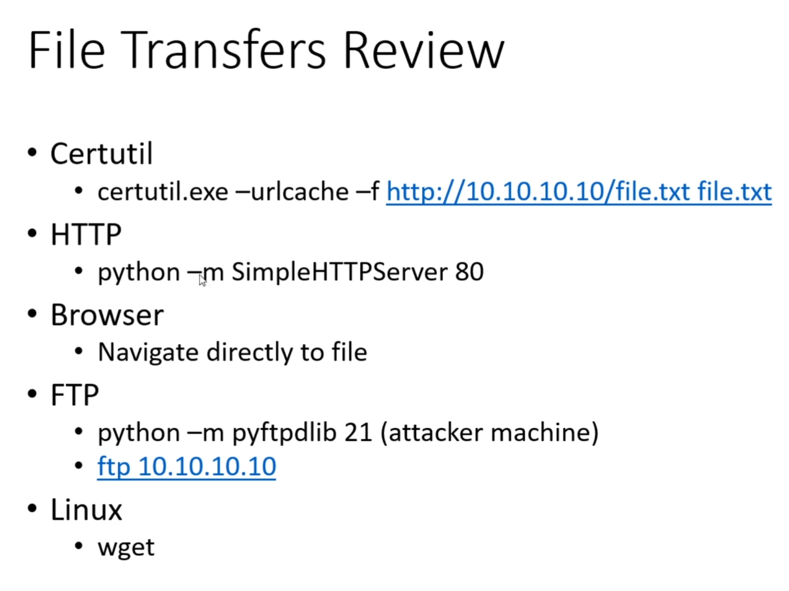

# Reverse shell vs Bind Shells

- Reverse = internal network

- Bind = external network

# staged vs non-staged payload

Payload that we send to from ```msfconsole``` to get reverse shell

| Non-staged                         | Staged                  |
| ---------------------------------- | ----------------------- |
| send exploit shellchode all at one | send payload in stages  |
| larg in size and wont always work  | can be less stable      |
| meterperter_reverse_tcp            | meterpreter/reverse_tcp |

If staged is not working, try another one.


# brute forcing SSH
GOALS:
- testing password strength
- okey to be lound so we can test how blue team prefroms
- defualt password


Tool:
- ```Hydra```
- ```msfconsole``` : ```auxiliary/scanner/ssh/ssh_login```


# impotant
- dont use port 4444 ```msfconsole``` irl since it is a defualt port for ```meterpreter```. Some antivirus might detect it and send alarm to sys admin

# File tranfer


# maintain access

