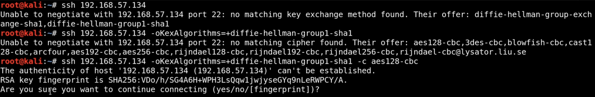

# Nmap:
to read [link](https://docs.google.com/document/d/1q0FziVZM3zCWhcgtPpljVPzkBX0fMAh6ebrXVM5rg08/edit)
scanning network
```console
$nmap -sn [iprange] #ping scanning, get MAC and IP for every stations
$nmap -sS -F [iprange] #scan open port + fast mode
$nmap -T4 -p- -A [ip]
$#T4 is the speed of scanning, fast=can be detect, slow = slow result
$#-p- is scann all port, cal also do -p [port] if you want to scan specific port.
$#if -p is not given, Nmap will scan only most common port (top 10000)
$#-A got all infomation about each port such as, service version, os version etc
```
Important: nmap some time give wrong OS name/version 
# Masscan
scan the whole fucking internet
```console
masscan -p1-65535 192.168.57.134
```
super slow tho. but it show you the port as fast as it find the open port, unlike nmap you need to wait until the scan it done to read the result
# Nessus
```console
kali@kali:~/Downloads$ sudo /etc/init.d/nessusd start
Starting Nessus : .
```
open https://kali:8834/ and you are good to go


note that you can only scan private IP address with Nessus free version
## basic scan
- scan type = can look for vulnerability
- can create report
- can schedule the time to start scan.

## advance scan
- scan network printer?
- brute force?
- can scan web application
- can enter credential and scan using it

# Enumerating Web
## nikto
- HTTP/HTTPS vulnerability scanning tool.
- Should run wafw00f before to check if there is a WAF behind WA
- If WA have good security machanism, it might block my IP
```console
$nikto -host [ip]  
```
## DirBuster
- brute forcing web app directory
- tool have nice UI + easy to use.
- need to give a wordlist ```usr/share/worldlist/dirbuster```
```console
kali@kali:~$ ls /usr/share/wordlists/dirbuster/
apache-user-enum-1.0.txt                 directory-list-2.3-medium.txt
apache-user-enum-2.0.txt                 directory-list-2.3-small.txt
directories.jbrofuzz                     directory-list-lowercase-2.3-medium.txt
directory-list-1.0.txt                   directory-list-lowercase-2.3-small.txt
kali@kali:~$ cat /usr/share/wordlists/dirbuster/directory-list-1.0.txt | wc -l
141708
kali@kali:~$ cat /usr/share/wordlists/dirbuster/directory-list-lowercase-2.3- | wc -l
cat: /usr/share/wordlists/dirbuster/directory-list-lowercase-2.3-: No such file or directory
0
kali@kali:~$ cat /usr/share/wordlists/dirbuster/directory-list-lowercase-2.3-small.txt | wc -l
81643
kali@kali:~$ cat /usr/share/wordlists/dirbuster/apache-user-enum-1.0.txt | wc -l
8930
kali@kali:~$ cat /usr/share/wordlists/dirbuster/apache-user-enum-2.0.txt | wc -l
10355
$dirbuster&
```

## GoBuster
- brute forcing web app directory like dirbuster
- CLI tool
- faster than dirbuster
```console
gobuster dir -u http://<ip>:3333 -w <word list location>
```
GoBuster flag	Description
```
-e	Print the full URLs in your console
-u	The target URL
-w	Path to your wordlist
-U and -P Username and Password for Basic Auth
-p <x>	Proxy to use for requests
-c <http cookies> Specify a cookie for simulating your auth
```
# Enumerating SMB
## msfconsole
use ```msfconsole``` using *auxililary module* (enumeration). check this module and find what  you are looking for. For instance:
- auxililary/scanner/smb/smb_version
- auxililary/scanner/smb/smb_ms17_10 (external blue)
## smbclient
```console
$ smbclient -L \\\\<ip>\\ # list the directory
$ smbclient \\\\<ip>\\<file> # connect to the directory
```
in smb:
- ```help``` for man page
- ``ls``
# Enumerating SSH

run as the figure, and you might get a banner which contain SSH version.
# Researching Potential Vulnerabilities
look through your note and do some research on each service one by one, no hurry give it a time. More you know is the easier it will be for you too

## online
- in google: "<service> exploit"
- cvedetails: looks for hight risk and remote code execution.
- rapid7 -> module options show how to use ```msfconsole```
- expolit-db.com = super nice but some are old and not working anymore

## offline
use ```searchsploit```
- you cannot be so specific here. search algorithm is weak
- remote = remote code execution
