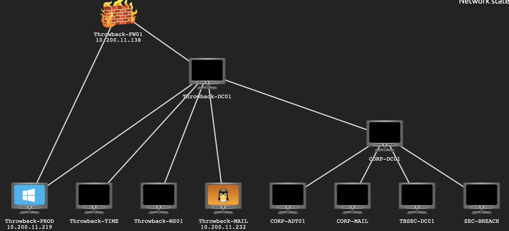

- THROWBACK-PROD: 10.200.11.219
- THROWBACK-FW01: 10.200.11.138
- THROWBACK-MAIL: 10.200.11.232
# Important notes
- http://timekeep.throwback.local/dev/passwordreset.php?user=murphyf&password=PASSWORD **to reset password!!** got it from MAIL

# ipsweep
```console
kali@kali:/opt$ sudo ./pymap.py -t 10.200.11.0/24 -pS
          
@@@@@@@   @@@ @@@  @@@@@@@@@@    @@@@@@   @@@@@@@  
@@@@@@@@  @@@ @@@  @@@@@@@@@@@  @@@@@@@@  @@@@@@@@  
@@!  @@@  @@! !@@  @@! @@! @@!  @@!  @@@  @@!  @@@  
!@!  @!@  !@! @!!  !@! !@! !@!  !@!  @!@  !@!  @!@  
@!@@!@!    !@!@!   @!! !!@ @!@  @!@!@!@!  @!@@!@!   
!!@!!!      @!!!   !@!   ! !@!  !!!@!!!!  !!@!!!    
!!:         !!:    !!:     !!:  !!:  !!!  !!:       
:!:         :!:    :!:     :!:  :!:  !:!  :!:       
 ::          ::    :::     ::   ::   :::   ::       
 :           :      :      :     :   : :   :        
Author: kuroHat
Github: https://github.com/gu2rks

sweeping on network: 10.200.11.0/24 
Looking for alive hosts...
Nmap scan report for 10.200.11.138
Nmap scan report for 10.200.11.219
Nmap scan report for 10.200.11.230
Nmap scan report for 10.200.11.232
```

## hosts
- FW01 = 10.200.11.138
- PROD = 10.200.11.219
- MAIL = 10.200.11.232
- **HOW IS 10.200.11.230? DC01?** : I try to ping this address and it return TTL 64, so I guess it is me lol
```
meterpreter > run arp_scanner -r 10.200.11.0/24
[*] ARP Scanning 10.200.11.0/24
[*] IP: 10.200.11.1 MAC 02:eb:1c:a4:33:73
[*] IP: 10.200.11.79 MAC 02:b9:b5:da:b7:43
[*] IP: 10.200.11.118 MAC 02:01:7d:c6:0c:a1
[*] IP: 10.200.11.117 MAC 02:2a:19:4e:a4:45
[*] IP: 10.200.11.138 MAC 02:4c:02:23:6c:65
[*] IP: 10.200.11.176 MAC 02:d3:42:f3:9e:1b
[*] IP: 10.200.11.222 MAC 02:7b:c6:d0:59:69
[*] IP: 10.200.11.232 MAC 02:e4:2b:d1:10:01
[*] IP: 10.200.11.243 MAC 02:bf:e2:f4:b7:c9
[*] IP: 10.200.11.255 MAC 02:7b:c6:d0:59:69
```
```
PS > Resolve-DNsName 10.200.11.176

Name                           Type   TTL   Section    NameHost
----                           ----   ---   -------    --------
176.11.200.10.in-addr.arpa.    PTR    1200  Question   THROWBACK-TIME
PS > Resolve-DNsName 10.200.11.117

Name                           Type   TTL   Section    NameHost
----                           ----   ---   -------    --------
117.11.200.10.in-addr.arpa.    PTR    1200  Question   THROWBACK-DC01
```
# Road map

## [Introductory to AD and PowerShell Section]
- [x] [Task 5] AD Basics (Reading)
- [x] [Task 6] Let’s Get Offensive (Reading)
- [x] [Task 7] Entering the Breach
- [x] [Task 8] Exploring the Caverns

## [Path 1 (Firewall Exploitation)]
- [x] [Task 9] Web Shells and You!
- [x] [Task 10] First Contact
- [x] [Task 14] We Will, We Will, Rockyou
- [ ] [Leads to Going Through the Transporter Path]

## [Path 2 (Phishing)]
- [x] [Task 11] Wait, just you mean just one this time?
- [x] [Task 12] Gone Phishing
- [x] [Task 21] You Dawg, I heard you like proxies
- [x] [Leads to Main Path]

## [Path 3 (LLMNR Poisoning & C2 Overview)]
- [x] [Task 13] Just a Drop Will Do
- [x] [Task 14] We Will, We Will, Rockyou
- [x] [Task 15] Building Your Own Dark... er DeathStar
- [x] [Task 16] Deploy the Grunts!
- [x] [Task 17] Get-Help Invoke-WorldDomination
- [x] [Task 18] SEATBELT CHECK!
- [x] [Task 19] Dump It Like It's Hot
- [x] [Task 20] Not the soft and fluffy kind
- [x] [Leads to Going Through the Transporter Path]

## [Going Through the Transporter Path (Proxies and Pivoting)]
- [x] [Task 21] You Dawg, I heard you like proxies.
- [x] [Task 22] Good Intentions, Courtesy of Microsoft
- [x] [Leads to Main Path]

## [Main Path (Lateral Movement)]
- [x] [Task 23] Wallace and Gromit
- [x] [Task 24] With three heads you'd think they'd at least agree once
- [x] [Task 25] You're Five Minutes Late...
- [x] [Task 26] Word to your Mother
- [x] [Task 27] Meterpreter session 1 closed. Reason: World-Domination 
- [x] [Task 28] We gotta drop the load!
- [x] [Task 29] So we're doing this again...
- [x] [Task 30] SYNCHRONIZE
- [x] [Task 31] This Forest has trust issues
- [x] [Task 32] r/badcode would like a word
- [x] [Task 33] Identity Theft is not a Joke Jim
- [x] [Task 34] So anyways, I just started hiring..
- [x] [Task 35] Lost and Found
- [x] [Task 36] You've Got Mail!
- [x] [Task 37] Kerberoasting II Electric Boogaloo
- [x] [Task 38] Endgame

ClemonsD
DunlopM
LoganF
IbarraA
YatesZ 
CopelandS
MckeeE 
HeatonC
FlowersK
HardinA
BurrowsA 
FinneganI 
GalindoI 
LyonsC
FullerS
SteeleJ
WangG
LoweryR
JeffersD 
GreigH
SharpK
KruegerM 
ChenI
VillanuevaD
BegumK